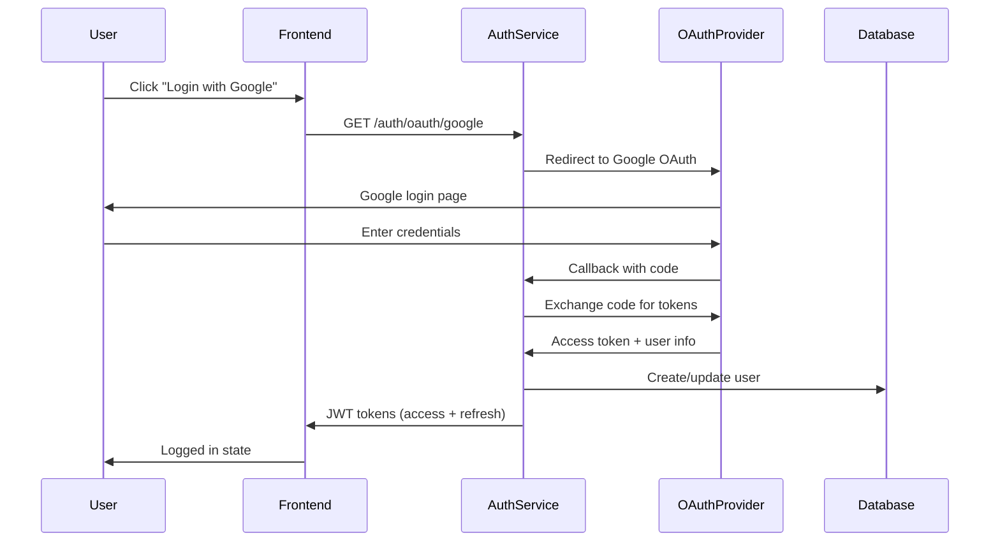

# Authentication Strategy

## Overview

This document outlines the comprehensive authentication strategy for the Whey Protein Price Comparison Platform, designed to support fitness enthusiasts with personalized features while enabling B2B API access and maintaining GDPR compliance.

## User Personas & Requirements

### Primary Users
- **Fitness Enthusiasts**: Personal price comparison, alerts, favorites, recommendations
- **API Consumers**: Developers integrating pricing data (freemium model)
- **Admins**: Platform management, analytics, content moderation
- **AI Services**: MCP server access for AI assistants

### Authentication Requirements
- **Public Access**: Core price comparison (no registration required)
- **Authenticated Access**: Price alerts, favorites, personalized recommendations
- **API Access**: Rate-limited free tier, paid high-usage tiers
- **Admin Access**: Protected dashboard with role-based permissions
- **GDPR Compliance**: Data encryption, export, deletion capabilities

## Authentication Architecture

### Multi-Tier Authentication System

```
┌─────────────────┐    ┌─────────────────┐    ┌─────────────────┐
│   Public API    │    │   User API      │    │   Admin API     │
│  (No Auth)      │    │  (JWT Required) │    │ (Enhanced Auth) │
└─────────────────┘    └─────────────────┘    └─────────────────┘
                                │                       │
                       ┌─────────────────┐    ┌─────────────────┐
                       │   OAuth 2.0     │    │   API Keys      │
                       │ (Social Login)  │    │  (B2B Access)   │
                       └─────────────────┘    └─────────────────┘
                                │                       │
                       ┌─────────────────┐    ┌─────────────────┐
                       │  User Session   │    │  Rate Limiting  │
                       │   Management    │    │   & Analytics   │
                       └─────────────────┘    └─────────────────┘
```

### Core Components

#### 1. Authentication Service
**Technology Stack**:
- JWT tokens (access + refresh)
- OAuth 2.0 for social login
- Redis for session/token management
- PostgreSQL for user data

**Features**:
- Multi-provider OAuth (Google, GitHub, Facebook)
- Email/password fallback
- Email verification
- Password reset functionality
- Account linking (multiple OAuth providers)

#### 2. Authorization Service
**Role-Based Access Control (RBAC)**:
- `public` - Anonymous users (price comparison only)
- `user` - Registered users (alerts, favorites, recommendations)
- `premium` - High-usage API access
- `admin` - Platform administration
- `super_admin` - Full system access

**Permission System**:
```go
type Permission string

const (
    PermissionViewPrices      Permission = "prices:read"
    PermissionCreateAlerts    Permission = "alerts:create"
    PermissionManageProducts  Permission = "products:manage"
    PermissionViewAnalytics   Permission = "analytics:read"
    PermissionManageUsers     Permission = "users:manage"
    PermissionAPIAccess       Permission = "api:access"
    PermissionHighRateLimit   Permission = "api:high_rate"
)
```

#### 3. User Management Service
**User Profile Data** (GDPR Compliant):
- Basic Info: Email, name, preferences (encrypted)
- Behavioral Data: Search history, favorites (anonymized)
- API Usage: Rate limiting, usage analytics
- Consent Management: Cookie preferences, data processing consent

**Data Encryption**:
- PII encrypted at rest using AES-256
- Separate encryption keys per data type
- Key rotation capability
- Zero-knowledge architecture for sensitive data

## API Authentication Strategies

### Public API (No Authentication)
**Endpoints**:
- `GET /api/products/search` - Product search
- `GET /api/products/{id}` - Product details
- `GET /api/products/{id}/prices` - Current prices
- `GET /api/retailers` - Retailer information
- `GET /api/brands` - Brand information

**Rate Limiting**: 100 requests/hour per IP

### User API (JWT Required)
**Endpoints**:
- `POST /api/auth/register` - User registration
- `POST /api/auth/login` - User login
- `GET /api/user/profile` - User profile
- `POST /api/user/alerts` - Create price alerts
- `GET /api/user/favorites` - User favorites
- `GET /api/user/recommendations` - Personalized recommendations

**Rate Limiting**: 1000 requests/hour per user

### API Key Access (B2B)
**Tiers**:
```yaml
free_tier:
  requests_per_hour: 1000
  endpoints: ["search", "products", "prices"]
  features: ["basic_data"]

developer_tier:
  requests_per_hour: 10000
  endpoints: ["all_public", "historical_data"]
  features: ["webhooks", "bulk_export"]
  price: "$29/month"

enterprise_tier:
  requests_per_hour: 100000
  endpoints: ["all_apis", "real_time_updates"]
  features: ["custom_integrations", "priority_support"]
  price: "Custom pricing"
```

**API Key Management**:
- Self-service key generation
- Usage analytics dashboard
- Automatic rate limiting
- Key rotation capability

### Admin API (Enhanced Security)
**Additional Security**:
- Multi-factor authentication (TOTP)
- Session timeout (30 minutes)
- IP allowlisting capability
- Audit logging for all actions

**Admin Endpoints**:
- `GET /admin/analytics` - Platform analytics
- `POST /admin/products` - Add/edit products
- `GET /admin/users` - User management
- `POST /admin/scrapers/config` - Scraper configuration

## OAuth 2.0 Implementation

### Supported Providers
1. **Google OAuth 2.0**
   - Scopes: `email`, `profile`
   - Provider: Google Identity Platform

2. **GitHub OAuth**
   - Scopes: `user:email`
   - Use case: Developer-focused users

3. **Facebook Login**
   - Scopes: `email`, `public_profile`
   - Use case: General fitness community

### OAuth Flow


## Session Management

### JWT Token Strategy
**Access Tokens**:
- Lifespan: 15 minutes
- Contains: user_id, roles, permissions
- Stateless validation
- Stored in memory (not localStorage)

**Refresh Tokens**:
- Lifespan: 7 days
- Stored in httpOnly cookie
- Rotating refresh (new token on each use)
- Revocable (stored in Redis)

**Token Structure**:
```json
{
  "sub": "user_123456",
  "email": "user@example.com",
  "roles": ["user"],
  "permissions": ["prices:read", "alerts:create"],
  "iat": 1642234800,
  "exp": 1642235700,
  "iss": "proteinprices.com",
  "aud": "proteinprices-api"
}
```

### Session Storage (Redis)
```redis
# User sessions
session:user_123456 -> {
  "refresh_token": "rt_abc123...",
  "last_activity": "2024-01-15T14:30:00Z",
  "ip_address": "192.168.1.1",
  "user_agent": "Mozilla/5.0...",
  "mfa_verified": true
}

# Rate limiting
rate_limit:api_key_xyz -> {
  "requests": 150,
  "window_start": "2024-01-15T14:00:00Z"
}

# Blacklisted tokens
blacklist:token_hash -> "2024-01-15T14:30:00Z"
```

## MCP Server Authentication

### API Key Authentication for AI Services
**Implementation**:
- Dedicated API keys for AI services
- Separate rate limits and permissions
- Request signing for enhanced security
- Audit logging for all AI interactions

**MCP-Specific Endpoints**:
```yaml
/mcp/auth:
  method: POST
  description: Authenticate AI service
  request:
    api_key: "mcp_key_abc123"
    service_name: "claude-ai"
  response:
    access_token: "jwt_token"
    expires_in: 3600

/mcp/capabilities:
  method: GET
  description: Get available tools
  headers:
    Authorization: "Bearer jwt_token"
```

## GDPR Compliance

### Data Classification
**Personal Data (Encrypted)**:
- Email addresses
- Names
- IP addresses (hashed)
- Search history

**Behavioral Data (Anonymized)**:
- Product preferences
- Click patterns
- Usage analytics

**Public Data (No Protection)**:
- Product reviews
- Public favorites (if opted-in)

### GDPR Features
1. **Right to Access**
   - `GET /api/user/data-export` - Complete data export

2. **Right to Rectification**
   - `PUT /api/user/profile` - Update personal data

3. **Right to Erasure** 
   - `DELETE /api/user/account` - Account deletion
   - Data anonymization after 30 days

4. **Right to Portability**
   - JSON export of all user data
   - Import functionality (future)

5. **Consent Management**
   - Granular cookie preferences
   - Marketing communication opt-in/out
   - Data processing consent tracking

### Privacy-by-Design Features
```go
type UserData struct {
    ID           string    `json:"id"`
    Email        string    `json:"email" encrypt:"true"`
    Name         string    `json:"name" encrypt:"true"`
    Preferences  string    `json:"preferences" encrypt:"true"`
    SearchHistory []Search  `json:"-" anonymize:"true"`
    CreatedAt    time.Time `json:"created_at"`
    ConsentGiven bool      `json:"consent_given"`
    DataRetentionUntil time.Time `json:"data_retention_until"`
}
```

## Database Schema

### User Management Tables
```sql
-- Users table (encrypted PII)
CREATE TABLE users (
    id UUID PRIMARY KEY DEFAULT gen_random_uuid(),
    email_hash VARCHAR(64) UNIQUE NOT NULL, -- SHA-256 hash for indexing
    email_encrypted BYTEA NOT NULL,         -- AES-256 encrypted email
    name_encrypted BYTEA,                   -- AES-256 encrypted name
    avatar_url VARCHAR(255),
    email_verified BOOLEAN DEFAULT FALSE,
    created_at TIMESTAMP DEFAULT NOW(),
    updated_at TIMESTAMP DEFAULT NOW(),
    last_login_at TIMESTAMP,
    is_active BOOLEAN DEFAULT TRUE,
    gdpr_consent_at TIMESTAMP,
    data_retention_until TIMESTAMP,
    
    -- Indexes
    INDEX idx_users_email_hash (email_hash),
    INDEX idx_users_created_at (created_at),
    INDEX idx_users_last_login (last_login_at)
);

-- OAuth providers
CREATE TABLE user_oauth_providers (
    id UUID PRIMARY KEY DEFAULT gen_random_uuid(),
    user_id UUID REFERENCES users(id) ON DELETE CASCADE,
    provider VARCHAR(50) NOT NULL, -- 'google', 'github', 'facebook'
    provider_user_id VARCHAR(255) NOT NULL,
    provider_email VARCHAR(255),
    access_token_encrypted BYTEA,
    refresh_token_encrypted BYTEA,
    expires_at TIMESTAMP,
    created_at TIMESTAMP DEFAULT NOW(),
    
    UNIQUE(provider, provider_user_id),
    INDEX idx_oauth_user_id (user_id),
    INDEX idx_oauth_provider (provider)
);

-- User roles and permissions
CREATE TABLE user_roles (
    id UUID PRIMARY KEY DEFAULT gen_random_uuid(),
    user_id UUID REFERENCES users(id) ON DELETE CASCADE,
    role VARCHAR(50) NOT NULL, -- 'user', 'premium', 'admin', 'super_admin'
    granted_at TIMESTAMP DEFAULT NOW(),
    granted_by UUID REFERENCES users(id),
    expires_at TIMESTAMP,
    
    UNIQUE(user_id, role),
    INDEX idx_user_roles_user_id (user_id)
);

-- API keys for B2B access
CREATE TABLE api_keys (
    id UUID PRIMARY KEY DEFAULT gen_random_uuid(),
    user_id UUID REFERENCES users(id) ON DELETE CASCADE,
    key_hash VARCHAR(64) UNIQUE NOT NULL, -- SHA-256 hash
    key_encrypted BYTEA NOT NULL,         -- AES-256 encrypted key
    name VARCHAR(100) NOT NULL,
    tier VARCHAR(50) NOT NULL,            -- 'free', 'developer', 'enterprise'
    rate_limit_per_hour INTEGER DEFAULT 1000,
    is_active BOOLEAN DEFAULT TRUE,
    last_used_at TIMESTAMP,
    created_at TIMESTAMP DEFAULT NOW(),
    expires_at TIMESTAMP,
    
    INDEX idx_api_keys_hash (key_hash),
    INDEX idx_api_keys_user_id (user_id)
);
```

### User Feature Tables
```sql
-- Price alerts
CREATE TABLE price_alerts (
    id UUID PRIMARY KEY DEFAULT gen_random_uuid(),
    user_id UUID REFERENCES users(id) ON DELETE CASCADE,
    product_id VARCHAR(255) NOT NULL,
    target_price DECIMAL(10,2) NOT NULL,
    retailer_ids TEXT[], -- Array of retailer IDs or NULL for all
    is_active BOOLEAN DEFAULT TRUE,
    last_triggered_at TIMESTAMP,
    created_at TIMESTAMP DEFAULT NOW(),
    
    INDEX idx_alerts_user_id (user_id),
    INDEX idx_alerts_product_id (product_id),
    INDEX idx_alerts_active (is_active)
);

-- User favorites
CREATE TABLE user_favorites (
    id UUID PRIMARY KEY DEFAULT gen_random_uuid(),
    user_id UUID REFERENCES users(id) ON DELETE CASCADE,
    product_id VARCHAR(255) NOT NULL,
    added_at TIMESTAMP DEFAULT NOW(),
    
    UNIQUE(user_id, product_id),
    INDEX idx_favorites_user_id (user_id)
);

-- User search history (anonymized)
CREATE TABLE user_search_history (
    id UUID PRIMARY KEY DEFAULT gen_random_uuid(),
    user_hash VARCHAR(64) NOT NULL,      -- Anonymized user identifier
    search_query_hash VARCHAR(64),       -- Hashed search terms
    category VARCHAR(100),
    timestamp TIMESTAMP DEFAULT NOW(),
    session_id VARCHAR(255),
    
    INDEX idx_search_history_user_hash (user_hash),
    INDEX idx_search_history_timestamp (timestamp)
);

-- GDPR data processing records
CREATE TABLE gdpr_requests (
    id UUID PRIMARY KEY DEFAULT gen_random_uuid(),
    user_id UUID REFERENCES users(id) ON DELETE CASCADE,
    request_type VARCHAR(50) NOT NULL,   -- 'export', 'delete', 'rectify'
    status VARCHAR(50) DEFAULT 'pending', -- 'pending', 'processing', 'completed'
    requested_at TIMESTAMP DEFAULT NOW(),
    completed_at TIMESTAMP,
    data_export_url VARCHAR(500),
    
    INDEX idx_gdpr_requests_user_id (user_id),
    INDEX idx_gdpr_requests_status (status)
);
```

## Security Implementation

### Password Security
- **Hashing**: Argon2id (recommended by OWASP)
- **Salt**: 32-byte random salt per password
- **Memory**: 64 MB memory cost
- **Iterations**: 3 iterations
- **Parallelism**: 4 threads

### Encryption Strategy
```go
type EncryptionService struct {
    masterKey []byte // 256-bit master key
    keyDerivation func(purpose string) []byte
}

// Encrypt PII data
func (e *EncryptionService) EncryptPII(data string, purpose string) ([]byte, error) {
    key := e.keyDerivation(purpose)
    return aes.GCMEncrypt([]byte(data), key)
}

// Data encryption purposes
const (
    EncryptionPurposeEmail = "email"
    EncryptionPurposeName  = "name" 
    EncryptionPurposeTokens = "tokens"
    EncryptionPurposeAPIKeys = "api_keys"
)
```

### Rate Limiting Strategy
```go
type RateLimiter struct {
    limits map[string]RateLimit
}

type RateLimit struct {
    RequestsPerHour int
    BurstAllowance  int
    WindowSize      time.Duration
}

var rateLimits = map[string]RateLimit{
    "public":     {RequestsPerHour: 100, BurstAllowance: 10},
    "user":       {RequestsPerHour: 1000, BurstAllowance: 50},
    "api_free":   {RequestsPerHour: 1000, BurstAllowance: 20},
    "api_dev":    {RequestsPerHour: 10000, BurstAllowance: 100},
    "api_enterprise": {RequestsPerHour: 100000, BurstAllowance: 1000},
    "admin":      {RequestsPerHour: 5000, BurstAllowance: 100},
}
```

## Frontend Integration

### Authentication Flow (React/Vanilla JS)
```javascript
class AuthService {
    constructor() {
        this.baseURL = '/api/auth';
        this.accessToken = null;
        this.refreshTimer = null;
    }

    // OAuth login
    async loginWithOAuth(provider) {
        window.location.href = `${this.baseURL}/oauth/${provider}`;
    }

    // Email/password login
    async login(email, password) {
        const response = await fetch(`${this.baseURL}/login`, {
            method: 'POST',
            headers: { 'Content-Type': 'application/json' },
            credentials: 'include', // Include refresh token cookie
            body: JSON.stringify({ email, password })
        });

        if (response.ok) {
            const { access_token } = await response.json();
            this.setAccessToken(access_token);
            this.scheduleTokenRefresh();
            return true;
        }
        return false;
    }

    // Automatic token refresh
    async refreshToken() {
        const response = await fetch(`${this.baseURL}/refresh`, {
            method: 'POST',
            credentials: 'include' // Refresh token in httpOnly cookie
        });

        if (response.ok) {
            const { access_token } = await response.json();
            this.setAccessToken(access_token);
            this.scheduleTokenRefresh();
        } else {
            this.logout();
        }
    }

    // API requests with auth
    async authenticatedRequest(url, options = {}) {
        if (!this.accessToken) {
            throw new Error('Not authenticated');
        }

        const response = await fetch(url, {
            ...options,
            headers: {
                ...options.headers,
                'Authorization': `Bearer ${this.accessToken}`
            }
        });

        if (response.status === 401) {
            await this.refreshToken();
            // Retry request with new token
            return this.authenticatedRequest(url, options);
        }

        return response;
    }
}
```

### User Context Provider
```javascript
const AuthContext = React.createContext();

export const AuthProvider = ({ children }) => {
    const [user, setUser] = useState(null);
    const [loading, setLoading] = useState(true);
    const authService = new AuthService();

    useEffect(() => {
        // Check for existing session on mount
        authService.refreshToken()
            .then(() => fetchUserProfile())
            .finally(() => setLoading(false));
    }, []);

    const login = async (provider) => {
        if (provider === 'email') {
            // Show email/password form
        } else {
            await authService.loginWithOAuth(provider);
        }
    };

    const logout = async () => {
        await authService.logout();
        setUser(null);
    };

    return (
        <AuthContext.Provider value={{ user, login, logout, loading }}>
            {children}
        </AuthContext.Provider>
    );
};
```

## Testing Strategy

### Authentication Tests
```go
// Unit tests
func TestUserRegistration(t *testing.T) {
    tests := []struct {
        name     string
        email    string
        password string
        wantErr  bool
    }{
        {"valid registration", "test@example.com", "SecurePass123!", false},
        {"duplicate email", "test@example.com", "SecurePass123!", true},
        {"weak password", "test2@example.com", "weak", true},
    }

    for _, tt := range tests {
        t.Run(tt.name, func(t *testing.T) {
            err := authService.Register(tt.email, tt.password)
            if (err != nil) != tt.wantErr {
                t.Errorf("Register() error = %v, wantErr %v", err, tt.wantErr)
            }
        })
    }
}

// Integration tests
func TestOAuthFlow(t *testing.T) {
    // Test OAuth callback handling
    // Test user creation/linking
    // Test JWT token generation
}

// E2E tests
func TestLoginFlow(t *testing.T) {
    // Test complete login flow in browser
    // Test social login redirects
    // Test protected route access
}
```

## Monitoring & Analytics

### Authentication Metrics
```go
var authMetrics = struct {
    LoginAttempts     prometheus.CounterVec
    LoginSuccesses    prometheus.CounterVec
    LoginFailures     prometheus.CounterVec
    TokenRefreshes    prometheus.Counter
    ActiveSessions    prometheus.Gauge
    APIKeyUsage       prometheus.CounterVec
    GDPRRequests      prometheus.CounterVec
}{
    LoginAttempts: prometheus.NewCounterVec(
        prometheus.CounterOpts{
            Name: "auth_login_attempts_total",
            Help: "Total number of login attempts",
        },
        []string{"provider", "result"},
    ),
    // ... other metrics
}
```

### User Behavior Analytics
- Registration funnel conversion
- OAuth provider preferences
- Feature adoption rates (alerts, favorites)
- API usage patterns
- GDPR request frequency

## Migration Strategy

### Phase 1: Core Authentication (Week 1-2)
- User registration/login
- JWT token system
- Basic user profile
- Password reset

### Phase 2: OAuth Integration (Week 3)
- Google OAuth
- GitHub OAuth  
- Facebook OAuth
- Account linking

### Phase 3: User Features (Week 4)
- Price alerts
- Favorites system
- User dashboard
- Basic recommendations

### Phase 4: API Authentication (Week 5-6)
- API key generation
- Rate limiting
- Usage analytics
- Developer dashboard

### Phase 5: Admin & Advanced Features (Week 7-8)
- Admin dashboard
- User management
- GDPR compliance tools
- MCP server authentication

### Phase 6: Optimization & Monitoring (Week 9-10)
- Performance optimization
- Security audits
- Analytics implementation
- Load testing

## Environment Configuration

### Development Environment
```yaml
# .env.dev
JWT_SECRET=dev_jwt_secret_32_characters_min
JWT_ACCESS_EXPIRY=15m
JWT_REFRESH_EXPIRY=7d

OAUTH_GOOGLE_CLIENT_ID=dev_google_client_id
OAUTH_GOOGLE_CLIENT_SECRET=dev_google_secret
OAUTH_GITHUB_CLIENT_ID=dev_github_client_id
OAUTH_GITHUB_CLIENT_SECRET=dev_github_secret

ENCRYPTION_MASTER_KEY=dev_32_byte_encryption_key_here
REDIS_AUTH_DB=1
POSTGRES_AUTH_DB=proteinprices_dev

GDPR_DATA_RETENTION_DAYS=30
RATE_LIMIT_ENABLED=false
```

### Production Environment
```yaml
# .env.prod (stored as secrets)
JWT_SECRET=prod_secure_random_jwt_secret_64_chars
JWT_ACCESS_EXPIRY=15m
JWT_REFRESH_EXPIRY=7d

OAUTH_GOOGLE_CLIENT_ID=${GOOGLE_CLIENT_ID}
OAUTH_GOOGLE_CLIENT_SECRET=${GOOGLE_CLIENT_SECRET}
OAUTH_GITHUB_CLIENT_ID=${GITHUB_CLIENT_ID}
OAUTH_GITHUB_CLIENT_SECRET=${GITHUB_CLIENT_SECRET}
OAUTH_FACEBOOK_CLIENT_ID=${FACEBOOK_CLIENT_ID}
OAUTH_FACEBOOK_CLIENT_SECRET=${FACEBOOK_CLIENT_SECRET}

ENCRYPTION_MASTER_KEY=${ENCRYPTION_MASTER_KEY}
REDIS_AUTH_DB=1
POSTGRES_AUTH_DB=proteinprices_prod

GDPR_DATA_RETENTION_DAYS=2555  # 7 years
RATE_LIMIT_ENABLED=true
```

This comprehensive authentication strategy provides a solid foundation for your platform's growth from fitness enthusiasts to enterprise API customers while maintaining security, privacy, and scalability.